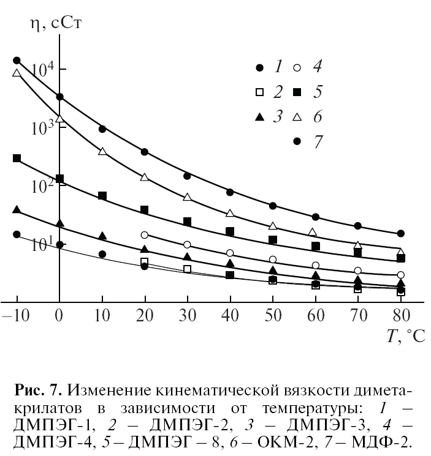
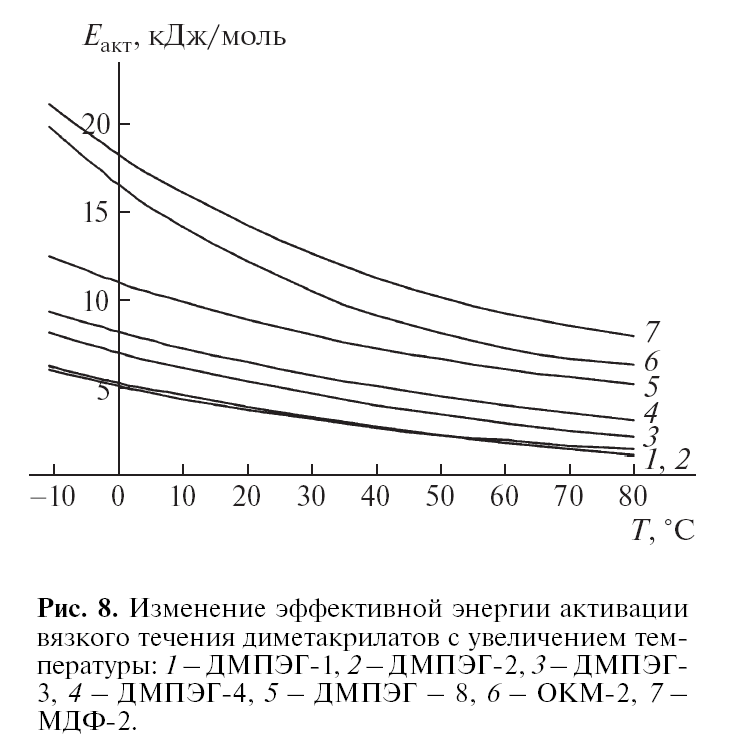

Вязкость видов DMAG Захарина М. Ю.
	ДМЭГ OK
v = 5.5 mm2/s
Q pol = 27.2 ccal/mol
KH = 0.16*1e-2

Вязкость всех растворов  Захарина М. Ю.

	ОКМ-2 - Ацетонитрил - OK
v[mm2/s] x[% добавки]:
30 5.3
20 11.4
10 35.5
5 47.3
0 145.9

	ДМПЭГ-3 - бензол -OK
60 1,5
40 2,3
30 3,1

Вязкости

Энегрия активации

https://spectrabase.com/spectrum/FKBmdqYSeWl
    PETA
T v:
25 700

https://scipoly.com/shop/pentaerythritol-tetraacrylate-2/
    PETA
    T v:
38 342

https://www.iea-amf.org/content/fuel_information/butanol/properties#:~:text=Viscosities%20of%20butanol%20isomers%20are,-4.5%20mm2%2Fs.
    n-Butanol
rho = 0.810 g/cm3
T nu [mPa*s]
20 2.9

T v [mm2/s]
20 3.6
40 2.3

https://www.dow.com/documents/327/327-00014-01-butanol-tds.pdf?iframe=true
    butanol-1
T nu[mPa*s]
20 2.947
